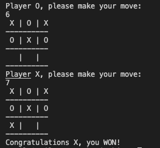
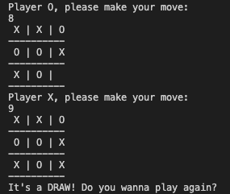

# TicTacToe
This is the project #3 of the Ruby Curriculum in Microverse


## Tic Tac Toe

This project consists of a Ruby version of the game [Tic Tac Toe](https://en.wikipedia.org/wiki/Tic-tac-toe).

## Getting Started

### Prerequisites
To run this project, you need a computer with Ruby installed.
> If you are uncertain on how to install Ruby, check out this [tutorial](https://www.theodinproject.com/courses/ruby-programming/lessons/installing-ruby-ruby-programming) made by [The Odin Project](https://www.theodinproject.com/about).

### How to Play
#### In your local enviroment:

1. Clone the repository:
```
https://github.com/VanessaAoki/TicTacToe.git
```
1. cd into the folder bin

2. Execute the file by using `$ main` on the terminal;

3. Enter your moves on the terminal and enjoy the game!

#### Live server:

1. If you prefer, you can run the game on your web browser by clicking on this [link](https://repl.it/@VanessaAoki/TicTacToe#main.rb);

2. Click on the green button that says 'Run' at the top of the page to start the tic tac toe game;

3. Enter your moves on the terminal and enjoy the game!

### Game Rules

1. Tic tac toe is a 2-player game, X and O;

2. Players alternate turns to choose a move on a 3x3 grid, like this one:
```
1 | 2 | 3
-----------
4 | 5 | 6	--> This is the tic tac toe board
-----------
7 | 8 | 9 
```
3. The first player to secure three consecutive positions on a row, column or diagonal wins;

4. The end games in a tie if neither player has won and all positions on the board are taken.

## Screenshot of the output



## Built With

- Ruby
- Visual Studio, Git & GitHub


## Authors

👩🏼‍💻 **Vanessa Aoki**

- GitHub: [@VanessaAoki](https://github.com/VanessaAoki)
- Twitter: [@VanessaSAoki](https://twitter.com/VanessaSAoki)
- Linkedin: [Vanessa Aoki](https://www.linkedin.com/in/vanessasaoki/)


🧑‍💻 **Sunil Kumar**

- GitHub: [@DsunilK](https://github.com/DsunilK)
- Linkedin: [@DsunilK](https://www.linkedin.com/in/dsunilk/)
- Twiter: [@DsunilK](https://twitter.com/D_sunil_K)


## 🤝 Contributing

Contributions, issues, and feature requests are welcome!

Feel free to check the [issues page](https://github.com/VanessaAoki/TicTacToe/issues).


## Show your support

Give a ⭐️ if you like this project!


## 📝 License

This project is [MIT](./LICENSE) licensed.